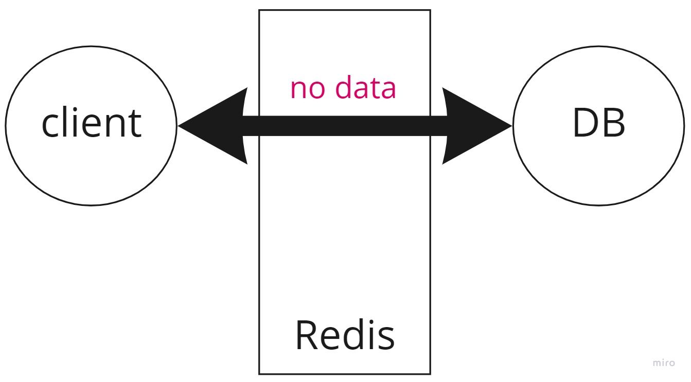

# A Complete Beginner Guide for Cache Penetration, Stampede, Avalanche

# Introduction

When it comes to cache, one of the biggest issues would be cache penetration, stampede, and avalanche, all of which are problems that need to be solved.

This article will be divided into two main parts.

In the first part, I will introduce what they are and how to solve the problems in theory. 

In the second part, there will be a practical example for each problem with real codes. 

- Prerequisite
    - You need the basic idea of cache and Redis, since the following experiments will be done with Redis.
    - It will be better to have the basic idea of Node.js (Express.js), the same reason as Redis.
    - It will also be better to have the basic idea of relational database and MySQL.

---

Before entering the main part, it should be noted here that when one of these issues happen, it is the database which will take much more pressure. 

Normally, we want to have Redis taking the pressure of as many requests as possible, but tons of requests will be hitting the database if one of these issue occur, and our database may go down due to this. 

In other words, we want to avoid any of these issues because we don’t want all requests to be hitting the database, since what we want to protect is nothing more than the **database** itself. 

# ****Cache Penetration****

## Definition

This happens when there is no corresponding key(data) in DB. Since there is no such key, there will be no cache for sure, and all the same requests will be hitting the database.

For example, a hacker is trying to attack your database, so he sends tons of requests in a few moments for a product with the id as -1. 

If it is a normal request, say, with the id as 1, then there will be cache in Redis after the first request. 

However, since no one will have any product with the id as -1, there will be no cache, and all the following requests will be hitting the database. 



## Solutions

1. Use rate limiter.
2. Use bloom filter to simply return the response if no such key exists.
3. If the key does not exist, simply send back an empty value and store it in Redis for a short period of time.

# ****Cache Stampede (Breakdown) (Thundering Herd problem)****

## Definition

This occurs when there are tons of requests at the same time, for the same key, and the cache just expired. 

For example, a great amount of people are competing for the same product at the same time. 


## Solutions

1. Simply use a worker to frequently update caches.
2. XFetch: set up a worker to update caches for the hot keys before expiration.
3. lock: Lock the key right after receiving the first request, until the cache is updated. Others will have to wait until the cache is updated. 

# ****Cache Avalanche (Cascading Failures)****

## Definition

Tons of requests for different keys appear, and are hitting the database because Redis is dead or all caches just expired. 

This happens a lot in the beginning of a holiday sales. 

This is called avalanche, because the death of Redis will cause the death of database, eventually will lead to the death of everything, like an avalanche. 


And if the database is dead and rebooting, all requests will be pending.

Right after the database is open, all pending requests will flush into the database, which will probably kill the database again.


If it is the case that all cache simply expired, it might also be Redis which is killed by all the pending request (avalanche again). 

## Solution

1. Simply adjust the TTL (time to live) of cache.
2. Building several layers of protection. For example,
    
    
    
3. Use Redis sentinel or clusters.

# First Part Conclusion

|  | Penetration | Stampede | Avalanche |
| --- | --- | --- | --- |
| Definition | 1. No corresponding key(data) in DB<br />2. Too many requests in a short time | 1. Too many requests simultaneously<br />2. For the same key<br />3. The cache just expired | 1. Too many requests simultaneously<br />2. For different keys<br />3. All cache expired or Redis is dead |
| Scenes | A hacker sends tons of requests for a non-existing key.  | Too many people are competing for the same product. | Holiday sales |
| Solutions | 1. Rate limiter<br />2. Bloom Filter<br />3. Store a key for a short time in Redis even if there is no key. | 1. Frequently update caches<br />2. XFetch<br />3. Lock the key while the first request appears. | 1. Adjust the TTL<br />2. Several layers of protection<br />3. Redis sentinel or clusters |

# Preparation for Implementation

## Preparation

1. git clone from: ‣
2. `npm install`
3. Start MySQL Server (ver. 8.0 or higher)
4. Import database: `mysql -u <user_name> -p <stylish_db_name> < dump.sql`
5. Start a Redis Server (ver. 6.2.6 or higher)
6. Create `.env` file based on `.env-template` (The cluster-related one will be explained later)

## Build Redis Cluster

### The Basic Idea

- The core idea is that, we cannot make sure that a Redis server will never go down, so we build a backup one.
- The slave server will copy any data in the master server (backup).
- While the master sever can read and write, the slave server can only read.


a main server with several slave servers


a slave will replace the master if the master is dead


This is what will become finally

### Clusters Concept

- A cluster consists of at least three master-slave sets (at least six nodes), and a set will have its own slots.
- Master servers will do health check for others beside themselves. For example, the node1-master will not do health check for the node3-master in the following schema.


- If a master dies and is found by another master, a slave of the dead master will promoted as the new master.

<aside>
💡 If all servers in a master-slave set goes down, the whole cluster goes down.

</aside>


- Any data coming from a server will be hashed and get a number for a specific slot.
- Any data will be stored into a master-slave set based on this new number.
- Any data is still accessible in the whole cluster.
- This method save storage since we don’t need to store data in all master-slave sets, and data is still accessible in any master-slave set in this cluster.


### Build Clusters

Completely follow [Creating a Cluster in Redis - YouTube](https://www.youtube.com/watch?v=N8BkmdZzxDg&ab_channel=Redis) to build a Redis cluster.

You can change the port as you want.

After that, you should be seeing something like this with `ps awx |grep redis-server`


Then, go back to the `.env` file and finish setting `CLUSTER_1` related settings. 

<aside>
💡 You might be wondering why we only need to connect to one server, and it is exactly valid to connect to only one server. It is also possible to make connections to all of them, go see `ioRedis` in `model.js` for details.

</aside>

# ****Cache Penetration**** Implementation

## Without Penetration Prevention

Start the server, and check if there is no error in the console.

Send a GET request to `localhost:3000/normal?id=1`, you will see the first response coming from DB, and other coming from cache in the next 10 seconds.

https://user-images.githubusercontent.com/55405280/160271199-966da942-ce7a-46b1-ac6c-35555f097100.mp4

Send a GET request to `localhost:3000/normal?id=-1`, you will see all responses coming from DB, because there is no data. This is cache penetration.

https://user-images.githubusercontent.com/55405280/160271205-f44ee69d-ecdc-407e-a218-1a1bafaaef38.mp4

The code is written in `cacheNormal.js`, which means if we simply set cache but do nothing else.

## With Penetration Prevention

Then, send a GET request to `localhost:3000/penetration?id=1`, you will see the first response coming from DB, and other coming from cache in the next 10 seconds, as epected.

https://user-images.githubusercontent.com/55405280/160271217-c729b136-4e11-46fe-9b37-3a75d9da6930.mp4

But this time, send a GET request to `localhost:3000/penetration?id=-1`, you will see responses other than the first coming from cache in the next 10 seconds.

https://user-images.githubusercontent.com/55405280/160271219-92f86f0f-6017-4bf6-9f6c-1f9058cd3f38.mp4

This is because I asked the server to add a new key with an empty value if there is no DB data, as what follows

```jsx
try {
    [[dbData]] = await db.execute(sql, preSta);
  } catch (err) {
    console.error(`Get db data error: ${err}`);
  }

  /*============ cache penetration prevention ============*/  
  if (!dbData) dbData = {};
  
  try {
    await cache.set(CACHE_KEY, JSON.stringify(dbData));
    await cache.expire(CACHE_KEY, CACHE_EXP);
    res.status(200).json({ data: dbData, source: "DB" });
    return;
  } catch (err) {
    console.error(`Set cache data error: ${err}`);
  }
```

# ****Cache Stampede**** Implementation

## Without Stampede Prevention

Suppose there are three customers sending requests for the same data at the same time, and the cache just expired.

As explained before, these three requests will be hitting DB at the same time, like the following video.

https://user-images.githubusercontent.com/55405280/160271224-67452288-def2-49d5-a32b-84632f872e56.mp4

---

Run `node testers.js`, and you will see three requests all coming from DB.

https://user-images.githubusercontent.com/55405280/160271232-eaef313c-c247-4cb9-8c4f-e02874a1dc01.mp4

## With Stampede Prevention

Then, go to `cacheStampede.js` and uncomment the following codes

```jsx
const isFirst = await cache.SETNX(CACHE_KEY);
  // console.log(isFirst);
  await cache.expire(CACHE_KEY, CACHE_EXP);
  if (!isFirst) {
    while(true) {
      cacheData = await cache.get(CACHE_KEY);
      if (cacheData) {
        res.status(200).json({ data: JSON.parse(cacheData), source: "cache" });
        break;
      }
    }
    return;
  }
```

Run `node testers.js`, and you will see only one request coming from DB.

https://user-images.githubusercontent.com/55405280/160271245-b4977e02-eda9-478c-a2c8-0444649d0669.mp4

What happens here is that, I ask these three requests to do `SETNX` right before they are going to DB. 

SETNX is almost the same as SET, but with a condition of `NOT EXIST`. Redis makes sure that only one request can do SETNX even if these three requests come at the same time, and only the successful one will be returned with `true`. 

We can console the `isFirst` to confirm this.

https://user-images.githubusercontent.com/55405280/160271250-37120f7a-55c2-4975-81a4-dd43bfe881b7.mp4

So that I make sure that there are two requests lost the SETNX race and get a `false` return. I ask them to keep trying to get data from the cache with `while(true)`. After the cache has been updated by the request which won the SETNX race, these two requests will get cache and leave this loop, like the following.

https://user-images.githubusercontent.com/55405280/160271260-473ab2e1-e22e-477f-abfb-750c39dcf018.mp4

By the way, I use `axios` to send requests, and `axios.all()` to send all requests at the same time. See `testers.js` for details.

# Cache Avalanche Implementation

Send a request to `localhost:3000/avalanche`, and it works normally that only the first request comes from DB.

Then, shutdown the Redis server which listens on port 7002. In the following five seconds (I personally set timeout as 5 seconds in the redis config file), the request will fail.

But after five seconds, cache will work as if nothing happened.

https://user-images.githubusercontent.com/55405280/160271264-ec8a635d-0e23-4fa7-9852-69188e4e2da4.mp4

---

Let me explain what happens here.

First, the cache data is stored into the third master-slave set.


Then, we shutdown the 7002-server, so in the next five seconds, all requests will be pending.

But after that, the 7007-server will be promoted as the master, so it will be working again. 


---

After entering any client of a server, we can use `cluster slots` and `cluster info` to see the whole situation of a cluster. 

For example, we can see cluster slots like this right after building a cluster

```
1) 1) (integer) 0
   2) (integer) 4095
   3) 1) "127.0.0.1"
      2) (integer) 7000
      3) "45166ee676b7783c4d8c3173ed96d505bda8eb8f"
   4) 1) "127.0.0.1"
      2) (integer) 7005
      3) "e2a62dbefd21bdac9d250514a0d93408c89c0af1"
2) 1) (integer) 4096
   2) (integer) 8191
   3) 1) "127.0.0.1"
      2) (integer) 7001
      3) "f644dab9a0126d24e85d74614653de71a1c6a7e0"
   4) 1) "127.0.0.1"
      2) (integer) 7006
      3) "2674da2dea38198d9dd02d639f5f403bd7c61a0a"
3) 1) (integer) 8192
   2) (integer) 12287
   3) 1) "127.0.0.1"
      2) (integer) 7002
      3) "37faed0606a873f0313f0199762404a890e54165"
   4) 1) "127.0.0.1"
      2) (integer) 7007
      3) "f22e79c2958769a8a49517d6b30f4187f9a548e1"
4) 1) (integer) 12288
   2) (integer) 16383
   3) 1) "127.0.0.1"
      2) (integer) 7003
      3) "3863a8746c9b0e9cb1678f967d7029392eee2fb3"
   4) 1) "127.0.0.1"
      2) (integer) 7004
      3) "c4baaf29c3f2f16e88b838982cf0a42f8316e332"
```

After the 7002-server went down and is replaced with the 7007-server, it will look like

```
1) 1) (integer) 0
   2) (integer) 4095
   3) 1) "127.0.0.1"
      2) (integer) 7000
      3) "45166ee676b7783c4d8c3173ed96d505bda8eb8f"
   4) 1) "127.0.0.1"
      2) (integer) 7005
      3) "e2a62dbefd21bdac9d250514a0d93408c89c0af1"
2) 1) (integer) 4096
   2) (integer) 8191
   3) 1) "127.0.0.1"
      2) (integer) 7001
      3) "f644dab9a0126d24e85d74614653de71a1c6a7e0"
   4) 1) "127.0.0.1"
      2) (integer) 7006
      3) "2674da2dea38198d9dd02d639f5f403bd7c61a0a"
3) 1) (integer) 8192
   2) (integer) 12287
   3) 1) "127.0.0.1"
      2) (integer) 7007
      3) "f22e79c2958769a8a49517d6b30f4187f9a548e1"
4) 1) (integer) 12288
   2) (integer) 16383
   3) 1) "127.0.0.1"
      2) (integer) 7003
      3) "3863a8746c9b0e9cb1678f967d7029392eee2fb3"
   4) 1) "127.0.0.1"
      2) (integer) 7004
      3) "c4baaf29c3f2f16e88b838982cf0a42f8316e332"
```

We can see in the third slot, there is no 7002 anymore, but only 7007. 

# Conclusion

In this article, I introduce three most famous cache issues and how to deal with them with real implementations. 

For cache penetration, I set a key with an empty value in Redis for a short time.

For cache stampede, I use SETNX to make sure only one request will be hitting my database.

For cache avalanche, I use Redis Cluster as a solution in case the Redis server goes down. 

Thanks for reading until here and hope you learned something.
